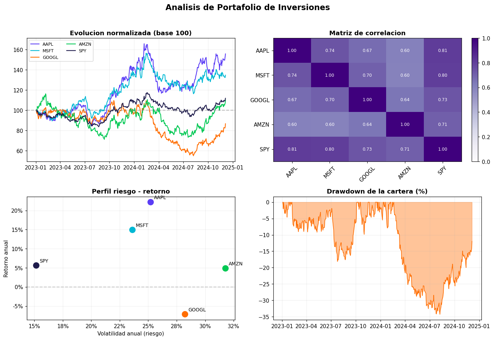

# Análisis Cuantitativo de Portafolio de Inversiones

Análisis de riesgo y retorno de un portafolio de acciones, con métricas
financieras estándar de la industria. Combina manipulación de datos en Python
con conceptos de finanzas cuantitativas.

## Objetivo

Evaluar el desempeño de cuatro activos tecnológicos (AAPL, MSFT, GOOGL, AMZN)
frente a un índice de referencia (SPY), y analizar si una cartera diversificada
mejora el perfil riesgo-retorno respecto del mercado.

## Métricas calculadas

Para cada activo y para la cartera completa:

- **Retorno anualizado** a partir de retornos logarítmicos diarios
- **Volatilidad anualizada** (desvío estándar × √252)
- **Sharpe ratio** (retorno ajustado por riesgo, sobre tasa libre de riesgo del 4%)
- **Máximo drawdown** (peor caída desde un pico)
- **Matriz de correlación** entre activos

## Resultados

| Activo | Retorno anual | Volatilidad | Sharpe | Máx. Drawdown |
|---|---|---|---|---|
| AAPL | 22.2% | 25.2% | 0.72 | -30.1% |
| MSFT | 14.9% | 23.6% | 0.46 | -26.5% |
| GOOGL | -7.1% | 28.2% | -0.39 | -51.7% |
| AMZN | 4.9% | 31.8% | 0.03 | -41.6% |
| **Cartera (25% c/u)** | **8.7%** | **23.4%** | **0.20** | **-34.2%** |
| SPY (benchmark) | 5.6% | 15.2% | 0.11 | -20.5% |

## Hallazgos clave

- La **cartera diversificada superó al índice en retorno** (8.7% vs 5.6%) y en
  Sharpe ratio (0.20 vs 0.11), pero con mayor volatilidad y drawdown.
- Las correlaciones entre los activos tech son altas (0.60–0.74): la
  diversificación es limitada porque tienden a moverse juntos.
- AAPL fue el activo con mejor relación riesgo-retorno; GOOGL, el de peor desempeño
  en el período analizado.
- El SPY confirma su rol de menor riesgo: la volatilidad más baja y el menor
  drawdown de todos.

## Dashboard



El dashboard muestra: evolución normalizada de precios, matriz de correlación,
perfil riesgo-retorno y curva de drawdown de la cartera.

## Nota sobre los datos

Las series de precios se generan de forma sintética con un modelo de movimiento
browniano geométrico calibrado con volatilidades y correlaciones realistas. Esto
permite reproducir el proyecto sin depender de APIs de pago. La metodología de
análisis es idéntica a la que se aplicaría sobre datos reales de mercado
(por ejemplo, descargados con `yfinance`).

## Técnicas aplicadas

- **Python (Pandas, NumPy):** series temporales, retornos logarítmicos, métricas
- **Finanzas cuantitativas:** Sharpe, drawdown, volatilidad, correlaciones
- **Visualización:** Matplotlib (dashboard de 4 paneles)

## Cómo ejecutarlo

```bash
pip install pandas numpy matplotlib
python 01_generar_precios.py
python 02_analisis_portafolio.py
python 03_visualizaciones.py
```
